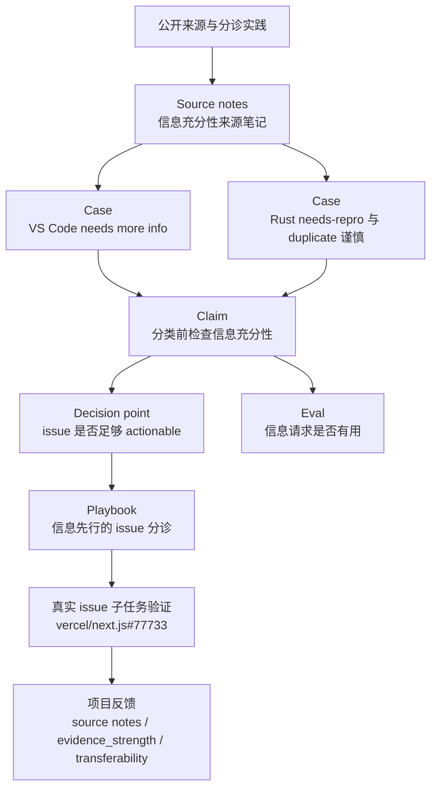

# GitHub Issue 分诊知识专题

这个专题展示 `agent-knowledge-lab` 在 GitHub Issue 分诊场景中已经积累的知识。当前重点不是“自动打标签”，而是验证 Agent 是否能先判断 issue 的信息是否足够，再决定下一步分诊动作。

## 核心结论

第一组知识验证出的核心判断是：

```text
在做类型分类、duplicate 判断、模块路由、优先级或关闭前，
先判断 issue 是否包含足够信息来支撑下一步决策。
```

这条知识目前是领域级假设，证据强度为 `medium`。它来自多个公开项目实践，但还没有经过大规模真实 issue 历史验证。

## 知识流



## 已积累的知识

### 原始来源

- [[raw-github-issue-information-sufficiency-source-notes]]

这份来源笔记记录了 GitHub Docs、Kubernetes、VS Code、Rust、Chatwoot 和 StackBlitz 中与 issue 信息充分性相关的公开实践。

### 案例卡

- [[case-vscode-needs-more-info-loop]]
- [[case-rust-needs-repro-and-duplicate-caution]]

案例卡用于重建项目里的真实或公开实践模式。VS Code 案例说明缺失信息可以成为阻塞分诊状态；Rust 案例说明 needs-repro 和 duplicate 判断应该区分。

### 知识主张

- [[claim-github-issue-info-sufficiency-before-classification]]

这条 claim 是当前专题的中心：信息充分性应该先于更强分类。

### 决策点

- [[dp-github-issue-triage-information-sufficiency]]

决策点把 claim 变成 Agent 在执行中要回答的问题：这个 issue 是否足够 actionable，可以安全支撑下一步分诊？

### Playbook

- [[playbook-github-issue-info-first-triage]]

Playbook 把知识组织成可执行步骤：读取 issue、抽取已有/缺失信息、判断缺失是否阻塞、输出 actionability、labels、reply draft、next step 和 confidence。

### Eval

- [[eval-github-issue-info-request-usefulness]]

Eval 用来判断 Agent 的信息请求是否真的推动 issue 前进，例如维护者是否接受、用户是否补充了有用信息、重复澄清是否减少。

### 项目反馈

- [[change-github-issue-triage-use-case-design-feedback]]
- [执行文档](../../docs/executions/2026-05-01-github-issue-triage-knowledge.md)

这次 use case 反过来推动了项目结构调整：增加 source notes、`evidence_strength`、`transferability`，并暴露出示例 ID 与真实知识 ID 需要区分的问题。

## Obsidian 阅读路径

1. 先打开 [[claim-github-issue-info-sufficiency-before-classification]]，理解核心主张。
2. 再看 [[dp-github-issue-triage-information-sufficiency]]，理解 Agent 执行时的判断点。
3. 打开 [[playbook-github-issue-info-first-triage]]，看这条知识如何变成操作步骤。
4. 回到两个案例卡，理解这个 claim 从哪里来。
5. 最后看 eval 和 change proposal，理解如何评估和迭代。

## 当前边界

- 已能支撑通用第一层 issue 分诊。
- 还不能可靠处理项目特定标签体系。
- 还缺少 Next.js 等具体项目的模块路由知识。
- 还缺少 duplicate search 的项目级证据阈值。
- 还没有用足够多的真实 issue 历史做验证。

## 下一步

下一阶段应该从领域级知识进入项目级知识，例如为某个真实项目建立：

- 标签词表
- 模块/团队路由规则
- duplicate 搜索方法
- 维护者回复偏好
- issue 生命周期反馈样本
